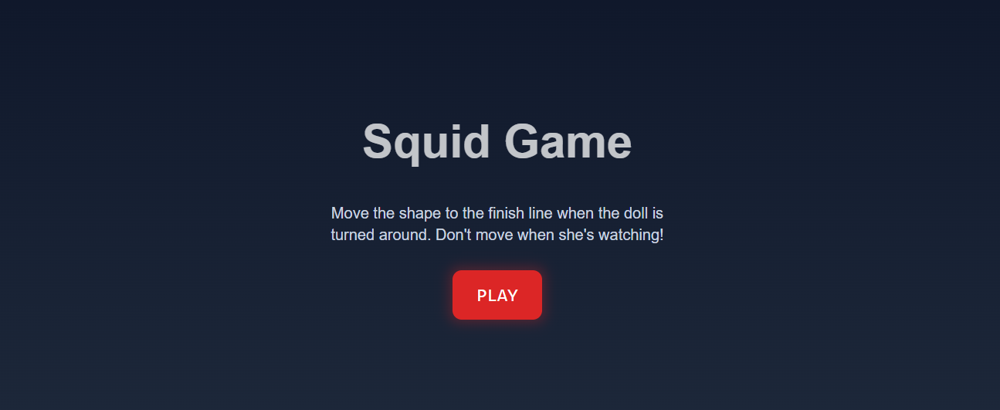
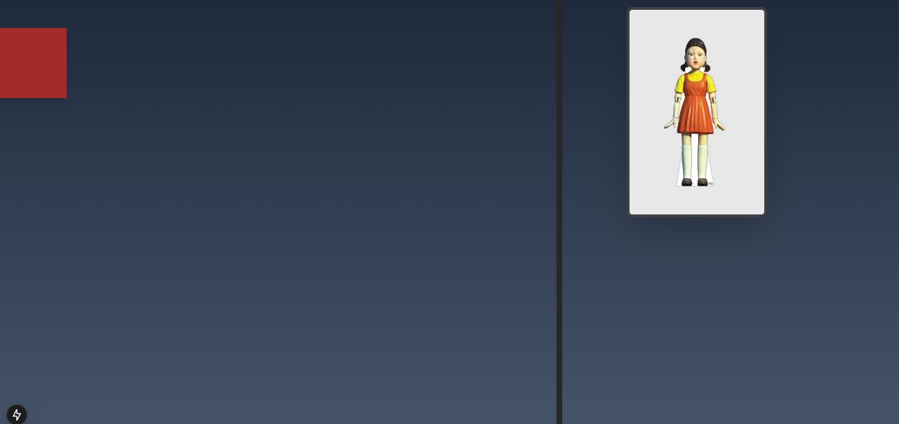

# 🦑 Squid Game Clone 🎮

A fun interactive game inspired by the "Red Light, Green Light" challenge from Squid Game, built using **Next.js, Redux, and Tailwind CSS**.

## 🚀 Features
- 🎭 **Randomized Image Switching** - The doll randomly switches between front and back views.
- 🖱️ **Mouse Movement Tracking** - Move the shape towards the finish line while avoiding detection.
- ❌ **Game Over Detection** - If you move while the doll is watching, you lose.
- ✅ **Winning Condition** - Reach the finish line without being caught.
- ⏳ **Timer Tracking** - Displays the time taken to complete the game.
- 🎨 **Dynamic Shape Styling** - The shape can change in size and appearance.

## 📸 Screenshots

## 🎮 How to Play
- Click the **PLAY** button to start the game.
- Move your mouse to advance the shape towards the finish line.
- Stop moving when the doll is **facing forward**.
- Reach **X: 700px** to **win**!
- If you move while the doll is watching, you lose!

---

Enjoy the game and challenge yourself! 🚀

